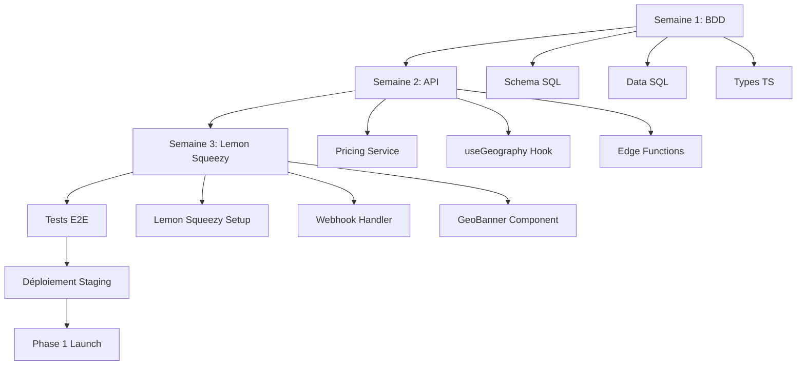

# Index - Documentation Internationalisation

**Dernière mise à jour :** 10 Novembre 2025  
**Statut :** Documentation complète Phase 0-1

---

## 📚 Vue d'Ensemble

Cette page regroupe **toute la documentation** liée au lancement international de DooDates, incluant la stratégie, l'architecture technique, l'implémentation et la conformité légale.

---

## 🎯 Documents Principaux

### 1. Stratégie & Vision

**[INTERNATIONAL-LAUNCH-STRATEGY.md](./INTERNATIONAL-LAUNCH-STRATEGY.md)**

- 📊 Analyse de marché (POP/POD)
- 🗺️ Roadmap de lancement (Phase 1: US/EU, Phase 2: Inde)
- 💰 Modèle économique freemium
- 📈 Stratégie Go-to-Market (Product Hunt, Reddit, HackerNews)
- ⚖️ Conformité juridique (RGPD, DPDP Act)
- 🎯 Métriques de succès (KPIs par phase)

**Quand utiliser :** Compréhension stratégique globale, décisions business, roadmap timeline.

---

### 2. Architecture Technique

**[INTERNATIONAL-PRICING-ARCHITECTURE.md](./INTERNATIONAL-PRICING-ARCHITECTURE.md)**

- 🏗️ Principes fondamentaux (découplage Géographie/Langue/Locale)
- 🌍 Détection géographique (Géo-IP, Cloudflare, IPinfo)
- 💳 Infrastructure paiements (Lemon Squeezy MoR)
- 🗄️ Schéma base de données (Price Lists pattern)
- 🤖 Localisation culturelle IA (prompting culturel)
- ⚖️ Conformité Règlement UE 2018/302
- 🛡️ Gestion des risques (VPN, fraude, perception client)

**Quand utiliser :** Spécifications techniques détaillées, décisions d'architecture, référence implémentation.

---

### 3. Guide d'Implémentation

**[INTERNATIONAL-PRICING-IMPLEMENTATION.md](./INTERNATIONAL-PRICING-IMPLEMENTATION.md)**

- 📅 Planning détaillé par semaine (Phase 0: 3 semaines)
- ✅ Checklists de tâches
- 💻 Exemples de code (TypeScript, SQL, React)
- 🧪 Guides de test (unitaires, intégration, E2E)
- 🚀 Procédures de déploiement
- 🔍 Vérifications post-déploiement

**Quand utiliser :** Implémentation pratique, développement quotidien, debugging.

---

## 🗂️ Fichiers Techniques

### Scripts SQL

**Location :** `sql-scripts/`

#### [international-pricing-schema.sql](../sql-scripts/international-pricing-schema.sql)

**Contenu :**

- Tables : `regions`, `price_lists`, `products`, `product_prices`
- Tables : `geo_detection_logs`, `transactions`
- Extensions colonnes : `users` (detected_country, price_list_id, preferences)
- Functions SQL : `get_price_list_for_country()`, `get_user_pricing()`
- Triggers : `update_updated_at_column()`
- RLS Policies : Sécurité Row Level

**Usage :**

```bash
psql $DATABASE_URL -f sql-scripts/international-pricing-schema.sql
```

---

#### [international-pricing-data.sql](../sql-scripts/international-pricing-data.sql)

**Contenu :**

- 6 régions (EU, CH, GB, NO, US, CA)
- 6 price lists (Phase 1)
- 4 produits (FREE, STARTER, PREMIUM, PRO)
- 24 prix (4 produits × 6 régions)
- Queries de vérification

**Usage :**

```bash
# Après international-pricing-schema.sql
psql $DATABASE_URL -f sql-scripts/international-pricing-data.sql
```

**Prix Phase 1 :**

| Produit     | EUR   | CHF       | GBP    | NOK    | USD   | CAD     |
| ----------- | ----- | --------- | ------ | ------ | ----- | ------- |
| **FREE**    | €0    | CHF 0     | £0     | 0 kr   | $0    | C$0     |
| **STARTER** | €9.99 | CHF 10.90 | £8.49  | 115 kr | $9.99 | C$12.99 |
| **PREMIUM** | €6.95 | CHF 7.50  | £5.95  | 79 kr  | $6.95 | C$8.95  |
| **PRO**     | €29   | CHF 32    | £24.90 | 335 kr | $29   | C$37.50 |

---

## 📁 Structure de Code à Créer

### Types TypeScript

**Fichier :** `src/types/pricing.ts`

- Interfaces : `Region`, `PriceList`, `Product`, `ProductPrice`
- Types : `PricingDisplay`, `UserGeography`

---

### Services & Hooks

**Fichier :** `src/lib/pricing/pricing-service.ts`

- `getPricingForCountry(country: string)`
- `getPricingForUser(userId: string)`
- `formatCurrency()`, `getPriceListForCountry()`

**Fichier :** `src/hooks/useGeography.ts`

- Hook React : `useGeography()`
- Détection automatique pays
- Persistance préférence utilisateur

---

### Supabase Edge Functions

**Fichier :** `supabase/functions/detect-country/index.ts`

- Détection via Cloudflare headers (gratuit)
- Fallback IPinfo (50k req/mois gratuit)
- Fallback ultime: US

**Fichier :** `supabase/functions/lemonsqueezy-webhook/index.ts`

- Gestion événements Lemon Squeezy
- Activation plans utilisateurs
- Logs transactions

---

### Composants UI

**Fichier :** `src/components/GeoBanner.tsx`

- Bannière suggestion pays (conformité UE 2018/302)
- Actions : Accepter / Refuser
- Persistance choix (localStorage)

**Fichier :** `src/components/CountrySelector.tsx`

- Sélecteur manuel pays/devise
- Position : Footer + Navigation + Pricing page
- UI : Dropdown avec drapeaux + devises

**Fichier :** `src/pages/Pricing.tsx` (à modifier)

- Affichage prix dynamiques selon géolocalisation
- Intégration `useGeography` hook
- Boutons achat vers Lemon Squeezy

---

## 🧪 Tests à Créer

### Tests Unitaires

**Fichier :** `src/lib/pricing/pricing-service.test.ts`

- Tests pricing par pays (FR, US, CH, GB, CA, NO)
- Tests formatage devises
- Tests mapping pays → price list

---

### Tests E2E

**Fichier :** `tests/e2e/international-pricing.spec.ts`

- Test affichage prix par pays
- Test sélecteur manuel pays
- Test bannière géo-suggestion
- Test compliance UE 2018/302 (pas de redirection forcée)
- Test flow paiement multi-devises

---

## 🔄 Workflow Implémentation



---

## 📊 Matrices de Décision

### Choix Technologiques

| Composant         | Options                                  | Choix Final                                 | Justification                                                |
| ----------------- | ---------------------------------------- | ------------------------------------------- | ------------------------------------------------------------ |
| **MoR**           | Stripe, Paddle, Lemon Squeezy            | ✅ Lemon Squeezy                            | Élimine 100% responsabilité fiscale, fees 5-7%, setup rapide |
| **Géo-IP**        | MaxMind, IPinfo, Cloudflare              | ✅ Cloudflare (primary) + IPinfo (fallback) | Gratuit, déjà disponible, 50k req/mois backup                |
| **i18n**          | react-intl, react-i18next, LinguiJS      | ✅ react-i18next                            | Standard industrie, 10M téléchargements/sem, pluralization   |
| **Analytics**     | Google Analytics, Plausible, Fathom      | ✅ Plausible                                | GDPR-friendly, pas de cookie, hébergement EU                 |
| **Pricing Model** | Prix dans Products, Price Lists, Dynamic | ✅ Price Lists                              | Flexibilité régionale, scalable Phase 2+                     |

---

## ⚖️ Conformité Légale

### Checklist RGPD (UE)

- [ ] Privacy Policy complète (via iubenda)
- [ ] Cookie consent banner
- [ ] Logs de consentement horodatés
- [ ] IP hashée (SHA-256), jamais en clair
- [ ] Export de données utilisateur (API)
- [ ] Suppression de compte (API)
- [ ] Chiffrement at-rest + in-transit
- [ ] DPO email visible

### Checklist Règlement UE 2018/302 (Géoblocage)

- [ ] Pas de redirection forcée basée sur IP
- [ ] Bannière suggestion pays avec consentement
- [ ] Sélecteur pays accessible (footer)
- [ ] "Shop-like-a-local" (acheter aux prix locaux même si étranger)
- [ ] Documentation claire différences prix/features

### Checklist DPDP Act 2023 (Inde) - Phase 2

- [ ] Consentement vérifiable (logs + timestamp)
- [ ] Langue claire (Hindi + English)
- [ ] Opt-in explicite
- [ ] DPO email de contact
- [ ] Réponse < 7 jours aux demandes
- [ ] Data localization (si > seuil)
- [ ] Notification breach < 72h

---

## 🎯 Métriques de Succès

### Phase 0 (Préparation)

**Timeline :** 3 semaines  
**Objectifs :**

- ✅ Base de données prix géographiques
- ✅ Détection Géo-IP fonctionnelle
- ✅ Intégration Lemon Squeezy
- ✅ Tests multi-pays passent

**KPIs :**

- [ ] 100% tables BDD créées
- [ ] 100% prix Phase 1 insérés
- [ ] 100% tests unitaires passent
- [ ] 100% tests E2E multi-pays passent
- [ ] 0 erreurs conformité UE

---

### Phase 1 (Launch US/EU)

**Timeline :** Mois 0-3  
**Pays :** FR, DE, IT, ES, GB, CH, US, CA

**KPIs :**

- Inscriptions : 1000+ utilisateurs
- Conversion Freemium→Payant : 5-10%
- K-factor viralité : > 1.2
- NPS : > 50
- Rétention J30 : 40%+

---

### Phase 2 (Expansion Inde)

**Timeline :** Mois 4-9  
**Pays :** IN

**KPIs :**

- Utilisateurs indiens : 500+
- Adoption Hindi : 60%+
- Paiements UPI : 60%+ transactions IN
- Conformité DPDP : 100%

---

## 🔗 Liens Utiles

### Documentation Externe

- [Règlement UE 2018/302](https://eur-lex.europa.eu/legal-content/FR/TXT/?uri=CELEX%3A32018R0302)
- [RGPD - Texte officiel](https://www.cnil.fr/fr/reglement-europeen-protection-donnees)
- [DPDP Act 2023 (Inde)](https://www.meity.gov.in/writereaddata/files/Digital%20Personal%20Data%20Protection%20Act%202023.pdf)
- [Lemon Squeezy Docs](https://docs.lemonsqueezy.com/)
- [IPinfo API](https://ipinfo.io/developers)
- [Cloudflare Geo Headers](https://developers.cloudflare.com/fundamentals/get-started/reference/cloudflare-headers/)

### Outils

- [Lemon Squeezy Dashboard](https://app.lemonsqueezy.com/)
- [Supabase Dashboard](https://app.supabase.com/)
- [IPinfo Dashboard](https://ipinfo.io/account/home)
- [iubenda (Privacy Policy)](https://www.iubenda.com/)
- [Plausible Analytics](https://plausible.io/)

---

## 📝 Notes Importantes

### 💡 Rappels Critiques

1. **Découplage Géo/Langue/Locale**  
   Ne **JAMAIS** utiliser la langue pour déduire le prix. Un francophone en Suisse doit voir l'UI en français mais payer en CHF.

2. **Conformité UE 2018/302**  
   Interdiction de redirection forcée. Toujours proposer avec consentement actif.

3. **IP Hash RGPD**  
   Ne **JAMAIS** stocker l'IP brute. Utiliser SHA-256 hash pour traçabilité sans identification.

4. **Lemon Squeezy = MoR**  
   Ils vendent en leur nom = Vous n'avez **aucune** responsabilité fiscale (TVA/GST/Sales Tax).

5. **VPN Detection**  
   Ne **PAS** bloquer les VPN. Utiliser BIN card matching pour détecter vraie fraude.

---

## 🤝 Contribution

### Ajouter une Nouvelle Région (Phase 2+)

1. **Mise à jour SQL** :

   ```sql
   -- Ajouter région
   INSERT INTO regions (code, name, countries, default_currency, tax_included)
   VALUES ('APAC_IN', 'India', ARRAY['IN'], 'INR', true);

   -- Ajouter price list
   INSERT INTO price_lists (region_id, code, name, currency, active)
   VALUES (...);

   -- Ajouter prix
   INSERT INTO product_prices (product_id, price_list_id, amount, tax_rate)
   VALUES (...);
   ```

2. **Mise à jour Code** :
   - `pricing-service.ts` : Ajouter pays dans `getPriceListForCountry()`
   - `detect-country` function : Ajouter dans mapping
   - `useGeography.ts` : Ajouter dans `getCurrencyForCountry()`

3. **Mise à jour i18n** :
   - Créer `src/i18n/locales/XX/` (ex: `hi/` pour Hindi)
   - Traduire tous les fichiers JSON
   - Ajouter dans `i18n/index.ts`

4. **Mise à jour Lemon Squeezy** :
   - Créer variants pour nouvelle devise
   - Mapper `lemonsqueezy_variant_id` dans BDD

5. **Tests** :
   - Ajouter tests unitaires nouveau pays
   - Ajouter tests E2E
   - Vérifier conformité légale locale

---

## 📞 Support

**Questions :** Créer une issue GitHub avec tag `international`  
**Bugs :** Rapporter avec logs + contexte pays  
**Améliorations :** Discussion GitHub ou PR

---

**Document maintenu par :** Équipe DooDates  
**Dernière mise à jour :** 10 Novembre 2025  
**Version :** 1.0
