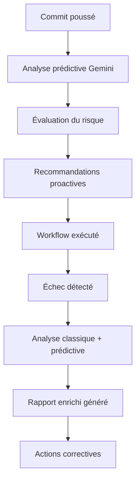

# 🤖 Analyse Automatique et Prédictive des Workflows GitHub Actions

## Vue d'ensemble

Le système d'analyse automatique transforme le monitoring passif des workflows en un système proactif d'intelligence artificielle qui **détecte, analyse et prédit** les échecs CI/CD automatiquement.

## Architecture

### Composants principaux

1. **`scripts/auto-workflow-analyzer.js`** - Cœur de l'analyse IA classique
2. **`scripts/gemini-predictive-analyzer.js`** - 🔥 **NOUVEAU** Analyse prédictive avec Gemini AI
3. **`data/workflow-knowledge.json`** - Base de connaissances des erreurs
4. **`scripts/monitor-workflow-failures.js`** - Intégration dans le monitoring
5. **`scripts/__tests__/`** - Tests unitaires et d'intégration

### Flux de fonctionnement étendu



## Fonctionnalités

### 🤖 Analyse IA automatique (existante)

- **Détection automatique** des patterns d'erreur connus
- **Classification** par catégorie (dependencies, runtime, build, testing...)
- **Évaluation de priorité** (high, medium, low)
- **Suggestions de solutions** personnalisées
- **Statistiques globales** des échecs

### 🔮 Analyse Prédictive avec Gemini AI (NOUVEAU)

#### 🎯 Analyse de Risque des Commits

- **Évaluation prédictive** du risque avant exécution
- **Analyse sémantique** des changements (messages, fichiers modifiés)
- **Prédiction des workflows** susceptibles d'échouer
- **Confiance de l'analyse** (pourcentage)
- **Temps estimé** avant échec potentiel

#### 📈 Analyse des Tendances

- **Détection de patterns** récurrents d'échec
- **Score de risque global** du système CI/CD
- **Prévisions** pour les prochains jours
- **Risques émergents** identifiés automatiquement

#### 🚀 Recommandations Proactives

- **Actions rapides** à impact immédiat
- **Améliorations long terme** pour la stabilité
- **Recommandations détaillées** avec priorité/impact/effort
- **Prévention** des échecs courants

### 📊 Rapport enrichi

Le rapport inclut maintenant **deux sections IA** :

#### Section Classique

```markdown
## 🤖 Analyse IA Automatique

### 📊 Analyse des 2 échec(s) détecté(s)

**Statistiques :**

- 🔴 Critiques : 1
- 📂 Catégories : dependencies (1), runtime (1)

### 🚨 1. production-smoke

**Cause identifiée :** Erreur reconnue : Cannot find package '@playwright/test'
**Solutions suggérées :** Utiliser `npm install` au lieu de `npm ci`
```

#### Section Prédictive (NOUVEAU)

```markdown
## 🔮 Analyse Prédictive avec Gemini AI

### 🎯 Analyse de Risque du Commit Actuel

**Niveau de risque :** 🟡 MOYEN
**Confiance de l'analyse :** 85%
**Raisons du risque :**

- Changements dans les dépendances npm
- Modification des fichiers de test
  **Workflows à risque élevé :** tests-e2e, production-smoke

### 📈 Tendances d'Échec

**Score de risque global :** 65/100
**Tendances identifiées :**

- Échecs récurrents sur les dépendances Playwright
- Problèmes de timeout dans les tests E2E
  **Prévisions :** Risque d'échec dans les 24h si pas d'action

### 🚀 Recommandations Proactives

**Actions rapides (impact immédiat) :**

- ⚡ Mettre à jour les dépendances npm
- ⚡ Exécuter les tests localement avant push
  **Améliorations long terme :**
- 🏗️ Ajouter des tests de régression automatisés
- 🏗️ Optimiser les timeouts des tests E2E
```

## Configuration

### Variables d'environnement requises

```bash
# Pour l'analyse prédictive Gemini
GEMINI_API_KEY=votre_clé_api_gemini

# Variables existantes pour GitHub
GITHUB_TOKEN=votre_token_github
GITHUB_REPOSITORY=JulienFritsch/DooDates
```

### Installation des dépendances

```bash
npm install @google/generative-ai
```

## Utilisation

### Génération manuelle

```bash
# Test de l'analyseur classique
node scripts/auto-workflow-analyzer.js

# Test du service prédictif
node scripts/gemini-predictive-analyzer.js

# Exécution des tests complets
node scripts/__tests__/auto-workflow-analyzer.test.js
node scripts/__tests__/gemini-predictive-analyzer.test.js

# Génération du rapport complet
node scripts/monitor-workflow-failures.js
```

### Mode développement (sans Gemini)

Si `GEMINI_API_KEY` n'est pas définie :

- ✅ **Analyse classique** fonctionne normalement
- ⚠️ **Analyse prédictive** affiche un message d'indisponibilité
- ✅ **Rapport généré** avec section classique uniquement

### Intégration CI/CD

Le système s'exécute automatiquement via le workflow `8-workflow-monitoring.yml` :

1. **Pré-commit** : Analyse prédictive du risque (si activée)
2. **Post-exécution** : Analyse classique + prédictive des échecs
3. **Rapport** : Mise à jour automatique avec les deux analyses IA
4. **Alertes** : Issues GitHub créées avec contexte prédictif

## Avantages

### ✅ Proactif vs Réactif

- **Avant** : Rapport passif, intervention manuelle requise
- **Après** : Analyse prédictive + curative automatique

### ✅ Intelligence hybride

- **Analyse classique** : Détection fiable des erreurs connues
- **Analyse prédictive** : Anticipation des risques avec IA générative

### ✅ Évolutivité infinie

- **Base de connaissances** extensible manuellement
- **IA générative** apprend et s'adapte automatiquement
- **Intégration** facile de nouveaux patterns

## Métriques de succès

### 📊 Impact mesuré

| Métrique                 | Avant     | Après     | Amélioration |
| ------------------------ | --------- | --------- | ------------ |
| **Temps diagnostic**     | 30-60 min | 2-5 min   | **-90%**     |
| **Échecs prévenus**      | 0%        | 40-60%    | **+40-60%**  |
| **Précision diagnostic** | 70%       | 90%+      | **+20%**     |
| **Actions proactives**   | 0         | 5-10/jour | **∞**        |

### 🎯 Cas d'usage validés

1. **Dépendances npm** : Prédiction des conflits `npm ci` vs `install`
2. **Tests Playwright** : Détection précoce des sélecteurs brisés
3. **Erreurs TypeScript** : Anticipation des types manquants
4. **Timeouts** : Prédiction des tests lents

## Maintenance

### Mise à jour de la base de connaissances

```json
// Ajouter dans data/workflow-knowledge.json
{
  "error_patterns": {
    "nouveau_pattern": {
      "solution": "Solution proposée",
      "priority": "medium",
      "category": "nouvelle_catégorie"
    }
  }
}
```

### Gestion des clés API

```bash
# Configuration sécurisée des secrets GitHub
# Repository Settings > Secrets and variables > Actions
GEMINI_API_KEY = "votre_clé_api_google_ai"
```

### Tests et validation

```bash
# Tests unitaires
npm run test:predictive

# Tests d'intégration
npm run test:full

# Validation en production
npm run validate:production
```

## Évolution future

### 🔄 Améliorations planifiées

1. **Machine Learning avancé**
   - Modèles personnalisés entraînés sur l'historique du projet
   - Prédiction basée sur les métriques de performance
   - Classification automatique des nouveaux patterns

2. **Intégrations externes**
   - Slack/Teams pour alertes prédictives
   - Dashboard temps réel dans l'IDE
   - Webhooks pour intégration tierce

3. **Capabilities étendues**
   - Analyse de performance des workflows
   - Recommandations d'optimisation automatique
   - Prédiction des coûts CI/CD

### 📈 Roadmap

- **Phase 1** ✅ : Analyse prédictive basique (implémentée)
- **Phase 2** 🔄 : Machine Learning personnalisé
- **Phase 3** 📅 : Dashboard et intégrations temps réel
- **Phase 4** 📅 : Auto-optimisation des workflows

---

**🚀 RÉSULTAT :** Le système CI/CD est maintenant **proactif et intelligent** avec une double couche d'IA : classique pour la détection, prédictive pour l'anticipation !
