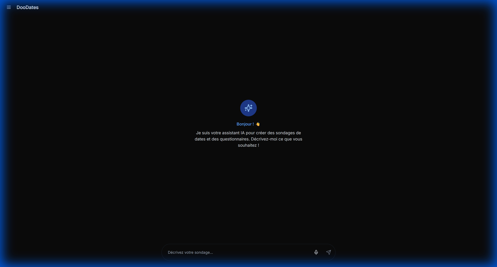
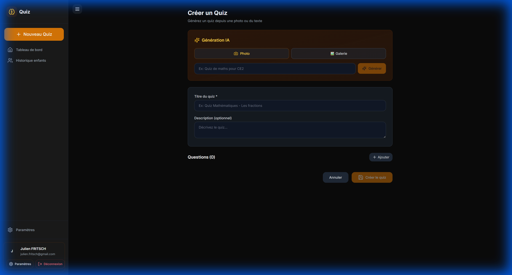

# 🚀 Guide de Démarrage Rapide

Bienvenue dans DooDates ! Ce guide vous permettra de créer votre premier sondage en moins de 5 minutes.

---

## 📋 Table des Matières

1. [Accéder à DooDates](#accéder-à-doodates)
2. [Interface Principale](#interface-principale)
3. [Créer Votre Premier Sondage](#créer-votre-premier-sondage)
4. [Partager et Voter](#partager-et-voter)
5. [Voir les Résultats](#voir-les-résultats)

---

## 🌐 Accéder à DooDates

### Option 1 : Sans Compte (Mode Invité)
1. Rendez-vous sur [doodates.com](https://doodates.com)
2. Commencez immédiatement à créer des sondages
3. Vos données sont stockées localement sur votre appareil

**Limites du mode invité :**
- Sondages stockés uniquement sur votre appareil
- Pas de synchronisation entre appareils
- Limité à 5 conversations IA (création de sondages avec l'IA)
- Données perdues si vous videz le cache du navigateur

### Option 2 : Avec Compte (Recommandé)
1. Cliquez sur "Se connecter" en haut à droite
2. Connectez-vous avec votre compte Google
3. Profitez de toutes les fonctionnalités :
   - ✅ Synchronisation multi-appareils
   - ✅ 1000 conversations IA (gratuit)
   - ✅ Historique complet
   - ✅ Sauvegarde automatique

---

## 🎨 Interface Principale

### Vue d'Ensemble



### Éléments de l'Interface

| Zone | Description |
|------|-------------|
| **En-tête** | Navigation principale, compte utilisateur, mode sombre |
| **Chat IA** | Conversation avec l'assistant pour créer vos sondages |
| **Zone de saisie** | Tapez ou dictez vos instructions |
| **Historique** | Accès à vos conversations et sondages précédents |
| **Dashboard** | Vue d'ensemble de tous vos sondages |

---

## 🎯 Créer Votre Premier Sondage

### Méthode 1 : Avec l'Assistant IA (Recommandé) ⚡

L'assistant IA comprend le langage naturel. Parlez-lui comme à un collègue !

#### Exemple 1 : Sondage de Dates
```
Vous : "Je veux organiser une réunion d'équipe la semaine prochaine, 
       mardi ou jeudi après-midi"

IA : "Parfait ! Je crée un sondage pour :
     - Mardi 12 novembre, 14h-17h
     - Jeudi 14 novembre, 14h-17h
     
     Quel titre voulez-vous donner à ce sondage ?"

Vous : "Réunion Sprint Planning Q4"

IA : "✅ Sondage créé ! Voici le lien de partage :
     doodates.com/vote/abc123
     
     Voulez-vous ajouter d'autres options ?"
```

#### Exemple 2 : Formulaire de Satisfaction
```
Vous : "Je veux créer une enquête de satisfaction client 
       avec des questions sur la qualité du service"

IA : "Excellent ! Je vous propose un formulaire avec :
     1. Note globale de satisfaction (1-5)
     2. Qualité du service (Échelle NPS 0-10)
     3. Points forts (Texte libre)
     4. Axes d'amélioration (Texte libre)
     
     Ça vous convient ?"

Vous : "Parfait, ajoutez aussi une question à choix multiples 
       sur les canaux de communication préférés"

IA : "✅ Question ajoutée ! Votre formulaire est prêt.
     Voulez-vous le tester avec des réponses simulées ?"
```

### Méthode 2 : Création Manuelle 🛠️

Si vous préférez créer manuellement :



#### Pour un Sondage de Dates
1. Cliquez sur **"Dashboard"** > **"Nouveau sondage"**
2. Sélectionnez **"Sondage de dates"**
3. Donnez un titre : *"Réunion d'équipe"*
4. Sélectionnez les dates dans le calendrier
5. Ajoutez des plages horaires (optionnel)
6. Cliquez sur **"Créer le sondage"**

#### Pour un Formulaire
1. Cliquez sur **"Dashboard"** > **"Nouveau formulaire"**
2. Donnez un titre : *"Enquête satisfaction"*
3. Cliquez sur **"Ajouter une question"**
4. Choisissez le type (choix unique, multiple, texte, etc.)
5. Rédigez votre question
6. Répétez pour chaque question
7. Cliquez sur **"Enregistrer"**

---

## 📤 Partager et Voter

### Partager Votre Sondage

Une fois votre sondage créé, vous obtenez un lien de partage unique :

```
https://doodates.com/vote/abc123def456
```

#### Options de Partage

**Copier le lien :**
- Cliquez sur l'icône 📋 "Copier le lien" dans le Dashboard
- Le lien est copié dans votre presse-papier
- Collez-le dans votre email, message, chat, etc.

**Note :** Les fonctionnalités de partage direct (email automatique, QR Code, intégrations) sont prévues pour une prochaine version.

### Voter sur un Sondage

#### Sondage de Dates
1. Ouvrez le lien du sondage
2. Entrez votre nom (ou restez anonyme)
3. Cliquez sur les dates/horaires disponibles :
   - 🟢 Vert = Disponible
   - 🟡 Orange = Peut-être
   - 🔴 Rouge = Indisponible
4. Cliquez sur **"Enregistrer mon vote"**

#### Formulaire
1. Ouvrez le lien du formulaire
2. Répondez aux questions une par une
3. Les questions conditionnelles s'affichent automatiquement
4. Cliquez sur **"Soumettre mes réponses"**
5. Option : Recevoir une copie par email

---

## 📊 Voir les Résultats

### Accéder aux Résultats

#### Option 1 : Depuis le Dashboard
1. Cliquez sur **"Dashboard"**
2. Trouvez votre sondage
3. Cliquez sur **"Voir les résultats"**

#### Option 2 : Depuis le Lien de Vote
1. Après avoir voté, cliquez sur **"Voir les résultats"**
2. (Selon les paramètres de visibilité définis par le créateur)

### Comprendre les Résultats

#### Sondage de Dates
```
┌─────────────────────────────────────────┐
│  Mardi 12/11, 14h-17h                   │
│  ████████████████░░░░ 80% (8/10)       │
│  ✓ Alice, Bob, Charlie, David...        │
│                                         │
│  Jeudi 14/11, 14h-17h                   │
│  ███████████░░░░░░░░░ 60% (6/10)       │
│  ✓ Alice, Emma, Frank...                │
└─────────────────────────────────────────┘
```

**🏆 Meilleure option :** Mardi 12/11 avec 80% de disponibilité

#### Formulaire
- **Graphiques automatiques** : Barres, camemberts, NPS
- **Statistiques** : Moyenne, médiane, distribution
- **Analytics IA** : Insights et tendances automatiques
- **Réponses détaillées** : Vue par répondant ou par question

### Actions Rapides

| Action | Description |
|--------|-------------|
| **Exporter** | CSV, PDF, JSON, Markdown |
| **Partager** | Copier le lien des résultats |
| **Modifier** | Éditer le sondage (si actif) |
| **Clôturer** | Fermer le sondage aux nouveaux votes |
| **Archiver** | Masquer du dashboard |
| **Supprimer** | Supprimer définitivement |

---

## ✨ Fonctionnalités Avancées Rapides

### 🤖 Analytics IA
Après avoir reçu des réponses, demandez à l'IA :
```
"Quelles sont les tendances principales ?"
"Y a-t-il des réponses surprenantes ?"
"Compare les réponses par âge"
```

**En savoir plus :** [Formulaires - Analytics IA](./04-Formulaires-Questionnaires.md#analyser-les-résultats-avec-analytics-ia)

### 🧪 Simulation de Réponses
Avant de partager votre formulaire :
```
1. Cliquez sur "Simuler des réponses"
2. L'IA génère 20-50 réponses fictives réalistes
3. Testez votre formulaire sans vrais répondants
4. Vérifiez la logique conditionnelle
```

### 📈 Quick Queries
Questions prédéfinies pour analyse rapide :
- "Quel est le taux de satisfaction moyen ?"
- "Combien de personnes ont répondu ?"
- "Quelle est la réponse la plus fréquente ?"

---

## 🎓 Prochaines Étapes

Maintenant que vous avez créé votre premier sondage, explorez :

1. **[Concepts de Base](./02-Concepts-Base.md)** - Comprendre en profondeur
2. **[Assistant IA](./05-Assistant-IA.md)** - Maîtriser l'assistant
3. **[Formulaires](./04-Formulaires-Questionnaires.md)** - Cas d'usage et exemples pratiques

---

## ❓ Questions Fréquentes

### Combien de sondages puis-je créer ?
- **Mode invité** : Illimité (stocké localement)
- **Compte gratuit** : Illimité
- **Conversations IA** : 5 (invité) / 1000 (compte gratuit) / Illimité (Pro)

### Mes données sont-elles sécurisées ?
Oui ! DooDates utilise :
- ✅ Chiffrement HTTPS (TLS 1.3)
- ✅ Stockage sécurisé (Supabase)
- ✅ Conformité RGPD
- ✅ Pas de vente de données

### Puis-je modifier un sondage après création ?
- **Sondages de dates** : Oui, tant qu'il n'y a pas de votes
- **Formulaires** : Oui, avec avertissement si déjà des réponses
- **Avec votes/réponses** : Modification limitée (ajout possible, suppression risquée)

### Le service est-il gratuit ?
Oui ! DooDates propose une version gratuite complète avec sondages illimités.

Pour plus de fonctionnalités (conversations IA illimitées, features avancées, intégrations, white-label), consultez notre **[page Tarifs](/pricing)**.

---

## 🆘 Besoin d'Aide ?

- 💬 **Chat support** : Icône 💬 en bas à droite
- 📧 **Email** : support@doodates.com
- 📖 **Documentation complète** : Explorez tous les guides depuis la page Documentation
- 🐛 **Signaler un bug** : feedback@doodates.com
- 💬 **Proposer une idée**: feature@doodates.com

---

**Prêt à créer votre premier sondage ?** 🚀  
[→ Concepts de Base](./02-Concepts-Base.md) | [→ Sondages de Dates](./03-Sondages-Dates.md)

---

**© 2025 DooDates - Guide de Démarrage Rapide v1.0**

